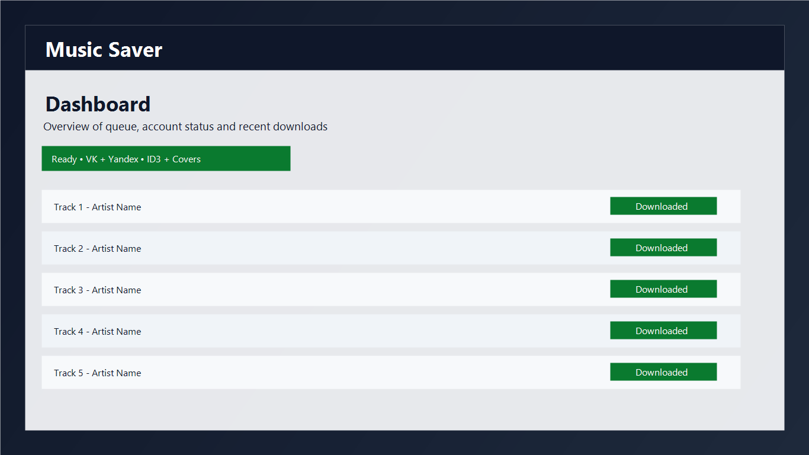
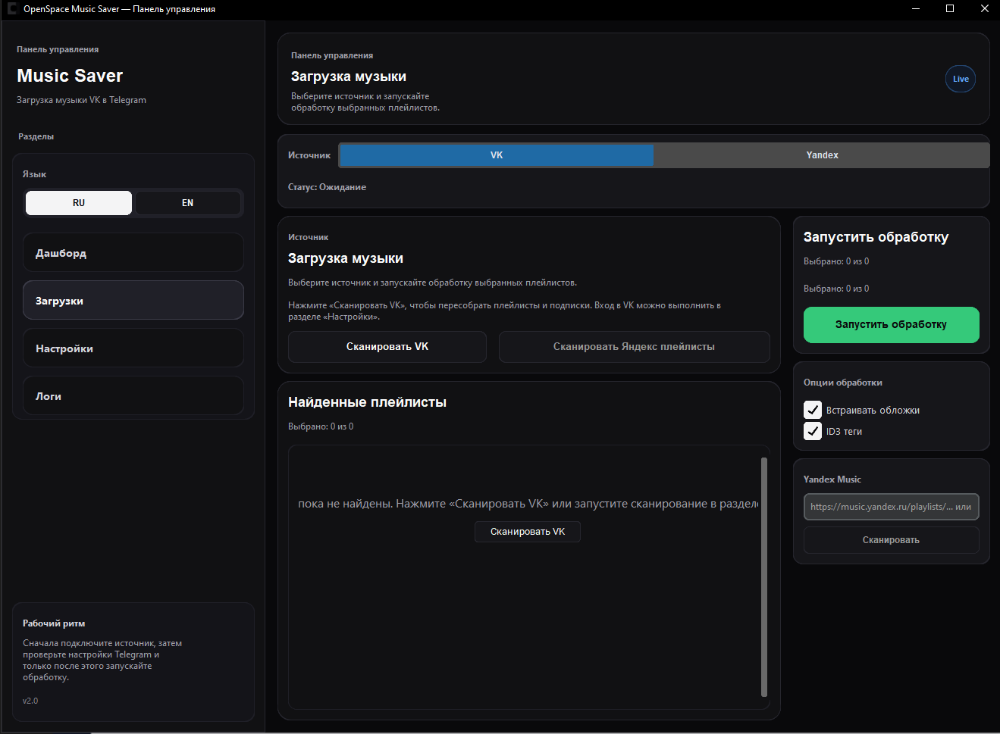
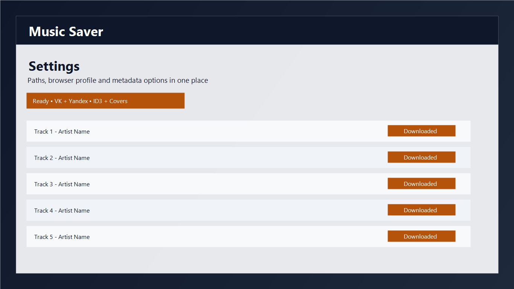

# Music Saver

<div align="center">

### 🎵 Desktop-приложение для переноса музыки из VK и Яндекса в локальную библиотеку

Локальный инструмент на Python с интерфейсом на CustomTkinter, автоматическим теггингом, историей загрузок и фокусом на независимую офлайн-медиатеку.


</div>

---

## Скачать для Windows

<div align="center">

[](../../releases/latest)

</div>

Если приложение нужно просто запустить, используйте GitHub Releases: скачайте архив последней версии и откройте `MusicSaver.exe`.

## Демо интерфейса


Скриншоты ключевых экранов:





## Что делает проект

`Music Saver` помогает переносить музыку из VK и Яндекс Музыки в удобный desktop-сценарий: с сохранением метаданных, обложек, истории загрузок и пользовательских настроек.

Проект ориентирован на сценарий «запустил и работаешь»: графический интерфейс, модульная архитектура и настройка через встроенные сервисы. Это инструмент для пользователей, которые хотят меньше зависеть от меняющихся каталогов, подписочных ограничений и ручной рутины при сборке своей музыкальной коллекции.

## Для кого этот проект

Проект нужен людям, которые:

- держат большие музыкальные библиотеки или плейлисты: от сотен треков, в том числе 500+ позиций;
- слушают музыку сразу в VK и Яндекс Музыке и хотят собрать это в одном локальном месте;
- хотят держать музыку у себя локально, а не только внутри стримингового сервиса;
- устали от того, что каталоги меняются, часть релизов исчезает или становится менее удобной для доступа;
- не хотят тратить время на ручное скачивание, переименование файлов и правку тегов;
- собирают собственную офлайн-библиотеку для плееров, бэкапов, NAS или обычной папки с музыкой на ПК.

`Music Saver` закрывает именно практическую задачу: быстро получить свою структурированную музыкальную библиотеку с нормальными именами файлов, тегами и обложками.

Главная сила проекта именно в автоматизации больших объёмов. Если у пользователя сотни треков, несколько крупных плейлистов или параллельно накоплена музыка и в VK, и в Яндексе, ручной сценарий становится слишком медленным и раздражающим. Здесь приложение экономит заметное количество времени.

Если же цель сводится к тому, чтобы скачать буквально пару треков, а большой библиотеки в стримингах нет, проект, скорее всего, не даст ощутимой пользы: он рассчитан не на единичные действия, а на системную работу с крупной коллекцией.

## Почему локальная библиотека снова важна

Когда доступ к контенту, условия подписок и состав каталогов постоянно меняются, пользователю нужен более устойчивый сценарий. Локальная медиатека решает это на уровне повседневного использования:

- музыка доступна офлайн без постоянной зависимости от платформы;
- файлы и метаданные остаются под контролем пользователя;
- библиотеку можно копировать, архивировать и переносить между устройствами;
- не нужно каждый раз заново приводить треки в порядок после скачивания.

## Ключевые возможности

- Загрузка музыки из VK через Selenium-автоматизацию.
- Экспорт треков из Яндекс Музыки в локальный workflow проекта.
- Обработка ID3-тегов (исполнитель, название, альбом, обложка).
- Локальная база SQLite для учёта загруженных треков.
- Разделённая архитектура: UI, доменная логика, сервисы, база данных.
- Дополнительные сервисы для Telegram и Яндекс-сценариев в составе проекта.

## Практическая ценность

- Экономит время на повторяющихся действиях при сборке музыкального архива.
- Особенно полезен при больших плейлистах и библиотеках от 500+ треков.
- Помогает перейти от платформозависимого прослушивания к собственной файловой библиотеке.
- Делает локальную коллекцию чище за счёт автоматического теггинга и обложек.
- Упрощает повторные загрузки благодаря истории и сохранённым настройкам.

## Требования

- Python `3.10+`
- Google Chrome (актуальная версия)
- Зависимости из `requirements.txt`

## Конфигурация

- `resources/app.default.toml` содержит versioned-дефолты приложения, UI-настройки и встроенные JS-скрипты.
- `data/settings.toml` создаётся автоматически при первом запуске и хранит пользовательские настройки.
- Если у пользователя уже есть `data/settings.json`, приложение автоматически перенесёт его в TOML.

## Быстрый старт

```bash
python -m venv .venv
# Windows
.\.venv\Scripts\activate

pip install -r requirements.txt
python main.py
```

## Основные SEO-запросы, которые описывает проект

Эти формулировки не как маркетинговый спам, а как естественное описание реального сценария использования:

- скачать музыку из VK на компьютер;
- перенести музыку из Яндекс Музыки в локальную библиотеку;
- desktop app для офлайн-музыки на Windows;
- Python-приложение для музыкальной коллекции с ID3-тегами;
- локальная музыкальная библиотека вместо зависимости от стримингов.

## GitHub release flow

- `pyproject.toml` хранит project metadata и базовые tool-настройки.
- `.github/workflows/ci.yml` проверяет импорт конфигурации и компиляцию Python-кода.
- `.github/workflows/release.yml` собирает Windows-архив из тега вида `v1.0.0`.

## Структура проекта

```text
src/
├─ app_controller.py        # оркестрация приложения
├─ ui/                      # окна, представления и компоненты интерфейса
├─ services/                # бизнес-сервисы (VK, Telegram, Yandex, загрузка)
├─ domain/                  # модели и теггер
├─ database/                # SQLite-менеджер и репозитории
└─ utils/                   # логирование и вспомогательные утилиты
```

## Сборка

Для сборки standalone-версии используется `PyInstaller`-спека:

- `vk_music_saver.spec`
- `build.ps1`

## Важное замечание

Репозиторий описывает инструмент для локальной организации и хранения музыкальной библиотеки пользователя. Формулировки в документации намеренно акцентируют контроль над собственными файлами, офлайн-доступ и экономию времени, а не зависимость от внешних платформ.

## Стабильность и hotfix-поддержка

VK и Яндекс могут менять верстку и API, поэтому интеграции иногда требуют быстрых обновлений. Если загрузка перестала работать, создайте Issue с шагами воспроизведения, и исправление попадет в ближайший hotfix-релиз.
